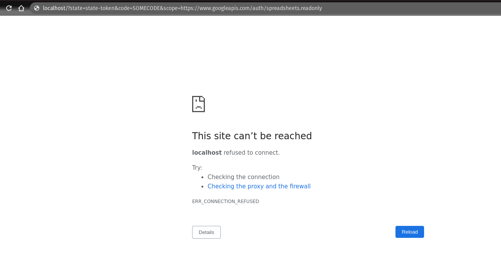
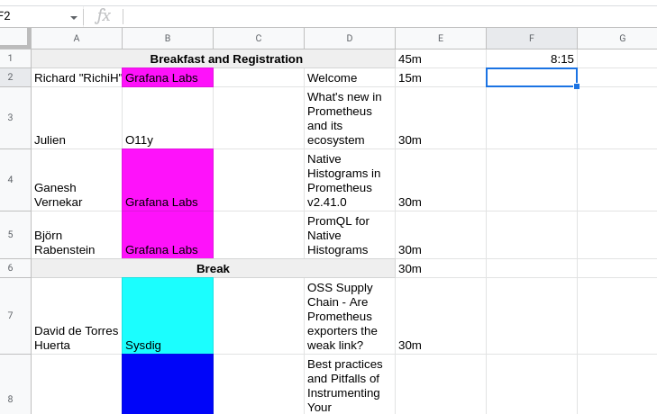

# shed_gsheettomd 

Go CLI that migrates PromCon schedule in Google Sheets to markdown files for `schedule.md`, `speakers/*.md` and `talks/*.md`.

### Using

1. Enable Google Sheets API and Credentials as mentioned in https://developers.google.com/sheets/api/quickstart/go
2. Download JSON to some file locally e.g. `client_secret.json`
3. Run CLI from this directory e.g `go run . -credentials.file client_secret.json -out.dir=../../content/2022-munich`
4. Open printed link in the browser
5. Error will pop up about unverified app. Click Advanced and continue (unsafe).
6. Error "localhost" not found will appear:

    

7. Copy the code=<...> parameter and paste back into terminal and hit enter.
8. You should see "Saving credential file to: token.json". From now one, whenever you run CLI the refresh key in `token.json` will be used (don't commit this file!)

### Adjusting for different format

Code currently executes two sheets in Google Sheets with the format as follows:

* Main schedule sheet:

* Talk details from form responses with header like `Accepted duration, Timestamp, Email Address, Full Name, Twitter handle (optional, used for mentions),	Affiliation (company or organization, if any), Short speaker biography, Speaker 2, Full Name, Speaker 2, Twitter handle (optional, used for mentions), Speaker 2, Affiliation (company or organization, if any), Speaker 2, Short speaker biography, Recording agreement, Title, Abstract`

Its expected this format is not too strict and likely change in next event Google sheet, so code will need to change a bit accordingly. See [sched.go](sched.go) for hardcoded constants.
